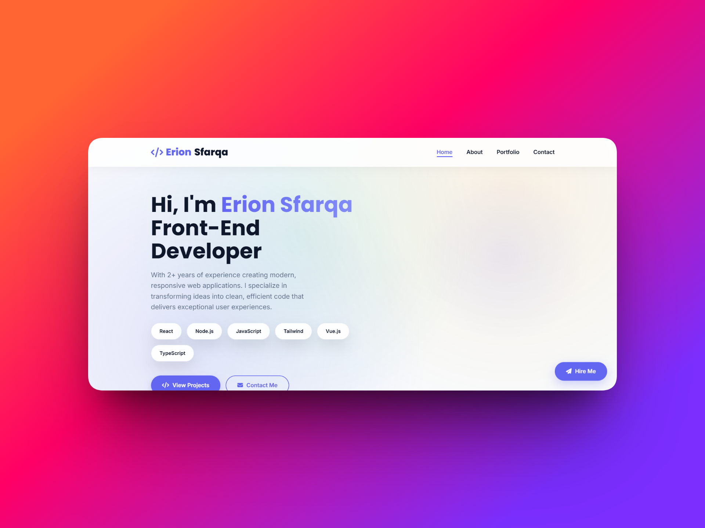
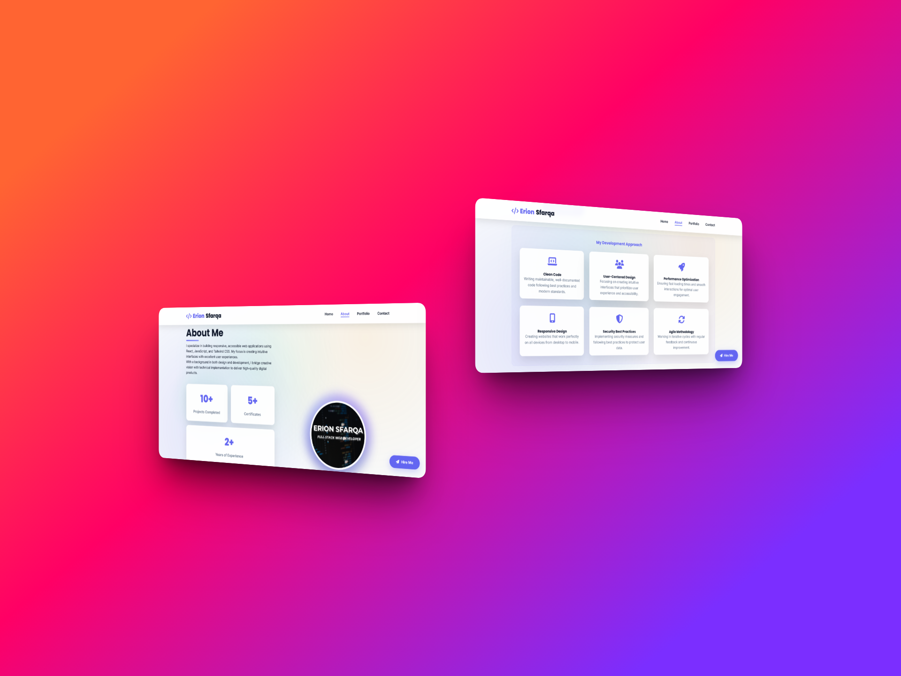
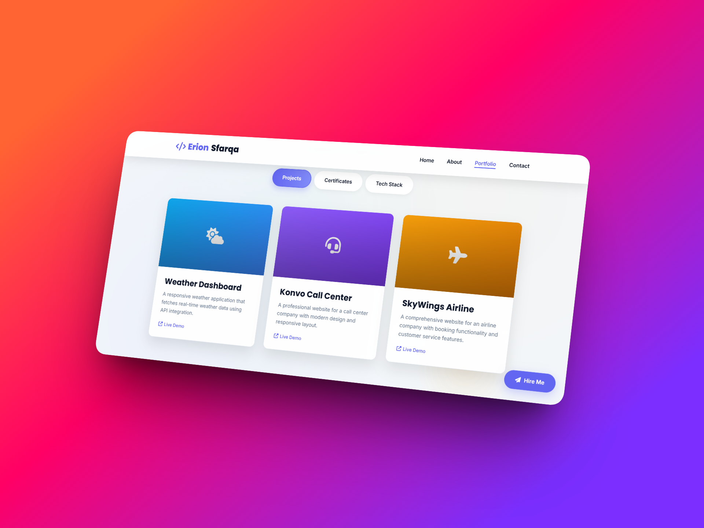
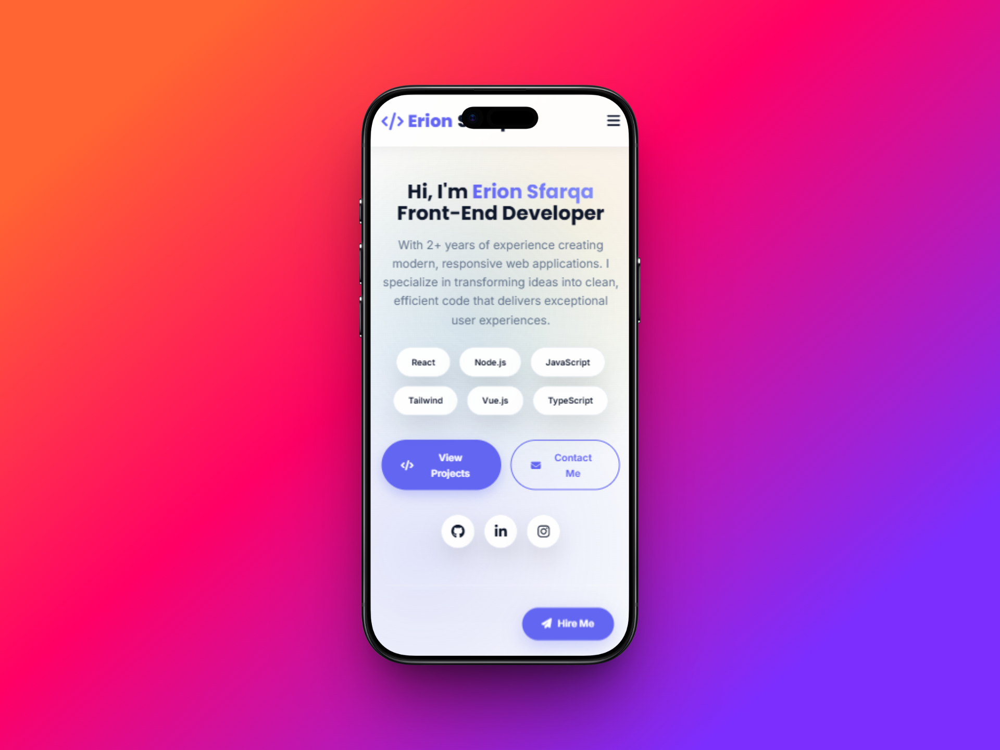
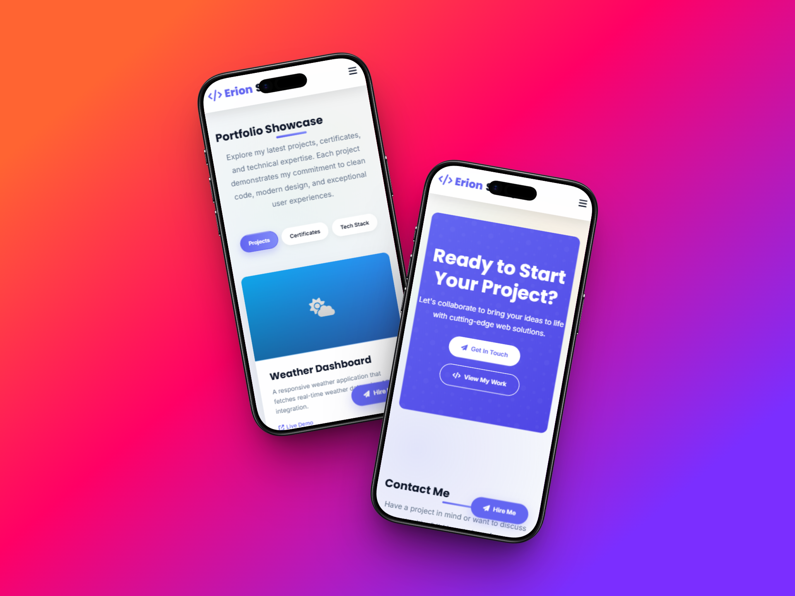
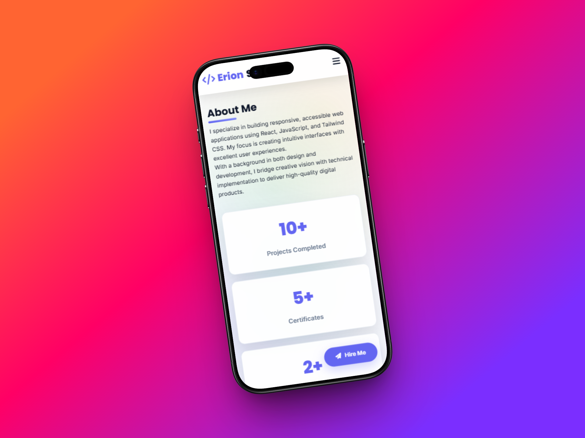

# Modern Full-Stack Developer Portfolio

A responsive personal portfolio showcasing web development skills with a clean aesthetic. Features interactive skill displays, project showcases, tech stack, certificates and contact form with smooth animations and professional design.
 
The site is live at https://erionsfarqa.github.io/Portofolio/

## Project Screenshots

  
Desktop views of the website

  
  
  
   
  
Mobile views of the website

    
  
  

